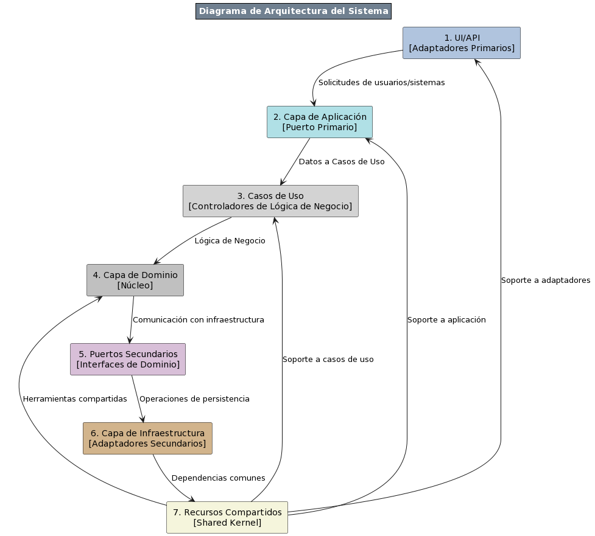

# ProductManagementAPI
# Sistema de Gestión de Productos

## Introducción
El Sistema de Gestión de Productos es una solución API REST desarrollada en .NET Core, orientada a la administración eficiente de un maestro de productos. Este sistema permite operaciones como inserción, actualización y consulta de productos. Se ha enfocado en adherir a los principios SOLID y Clean Code, utilizando patrones de diseño como el Mediator Pattern, Repository Pattern y CQRS, y aplicando TDD en su desarrollo.

## Arquitectura y Patrones Utilizados
Este proyecto está construido sobre una arquitectura hexagonal de puertos y adaptadores, lo que facilita la separación entre la lógica de negocios y las interfaces externas. 
Esta arquitectura está íntimamente relacionada con Domain-Driven Design (DDD), permitiendo un enfoque centrado en el dominio del problema. Además, se utiliza CQRS para una clara separación entre las operaciones de comando y consulta, mejorando la escalabilidad y mantenimiento del sistema. Los patrones y enfoques clave incluyen:
- Arquitectura Hexagonal (Puertos y Adaptadores) para una separación efectiva entre la lógica de negocio y las interfaces externas.
- DDD para un enfoque centrado en el dominio y manejo efectivo de la complejidad del negocio.
- CQRS para separar las operaciones de lectura y escritura, optimizando el rendimiento y escalabilidad.
- Mediator Pattern para desacoplar la lógica de negocio.
- Repository Pattern para abstracción de acceso a datos.
- TDD para garantizar un desarrollo confiable y mantenible.

### Diagrama de la Arquitectura del Sistema



1. **UI/API [Adaptadores Primarios]:** Interfaz para la interacción usuario-sistema. Traduce y dirige solicitudes externas a la capa de aplicación.
2. **Capa de Aplicación [Puerto Primario]:** Gestiona el flujo de operaciones y coordina las acciones entre la interfaz de usuario y la lógica de negocio.
3. **Casos de Uso [Controladores de Lógica de Negocio]:** Implementa la lógica específica del negocio, procesando y respondiendo a las solicitudes de la capa de aplicación.
4. **Capa de Dominio [Núcleo]:** Contiene el modelo de dominio y las reglas de negocio centrales, actuando como el corazón del sistema.
5. **Puertos Secundarios [Interfaces de Dominio]:** Define las interfaces para la comunicación entre el dominio y los servicios externos o la capa de infraestructura.
6. **Capa de Infraestructura [Adaptadores Secundarios]:** Proporciona implementaciones concretas para interactuar con bases de datos, servicios web y otros sistemas externos.
7. **Recursos Compartidos [Shared Kernel]:** Incluye funcionalidades y recursos comunes utilizados por múltiples componentes del sistema.

## Test-Driven Development (TDD)
El desarrollo de este proyecto ha seguido la metodología TDD, enfocándose en las siguientes tres fases iterativas y esenciales:

- **Fase Roja:** Se escriben pruebas que definen una mejora deseada o una nueva funcionalidad. Al principio, estas pruebas fallan ya que el código que satisface los requerimientos todavía no existe.

- **Fase Verde:** Se escribe el código mínimo necesario para pasar la prueba, sin preocuparse por la perfección. El objetivo en esta fase es cumplir con los requerimientos de la prueba de manera efectiva.

- **Fase de Refactorización:** Se revisa el código para eliminar redundancias y mejorar la legibilidad, sin afectar su funcionalidad. Es en esta fase donde se aplican los principios de Clean Code y se mejora el diseño.

# Estructura del Proyecto ProductManagementAPI

Este documento detalla la estructura del proyecto ProductManagementAPI.

### Proyecto Principal API

El proyecto principal se encuentra en la carpeta `/ProductManagementAPI/ProductManagementAPI/`. Esta carpeta contiene la lógica principal de la API, incluyendo los controladores, servicios y configuraciones.


## Código Fuente
### `/src` - Contiene el código fuente principal del proyecto.

#### Contextos

- `/ProductManagementAPI.Contexts`
  - `ProductContext`

#### Capa de Aplicación

- `/ProductManagementAPI.Product.Application`
  - `Dependencias` - Contiene las dependencias necesarias para el contexto de la aplicación.
  - `commands` - Comandos utilizados para ejecutar acciones.
  - `dto` - Objetos de Transferencia de Datos que definen la estructura de los datos para transferencias.
  - `events` - Eventos que se disparan en respuesta a ciertas acciones dentro de la aplicación.
  - `handlers` - Manejadores que procesan los comandos y eventos.
  - `helpers` - Clases auxiliares que proporcionan funcionalidades comunes a lo largo de la aplicación.
  - `interfaces` - Define las interfaces que deben ser implementadas para la lógica de aplicación.
  - `mappers` - Mapeadores que transforman objetos de una forma a otra.
  - `queries` - Consultas utilizadas para leer datos.
  - `services` - Servicios que contienen la lógica de negocio.
  - `usecases` - Casos de uso que definen las operaciones disponibles en la aplicación.

#### Capa de Dominio

- `/ProductManagementAPI.Product.Domain`
  - `Dependencias` - Contiene las dependencias necesarias para el contexto de dominio.
  - `aggregates` - Agrupaciones de entidades que son tratadas como una sola unidad para las transacciones.
  - `dto` - Objetos de Transferencia de Datos específicos del dominio.
  - `entities` - Entidades que son los principales objetos de negocio.
  - `factory` - Métodos de fábrica que crean instancias de entidades o agregados.
  - `interfaces` - Interfaces que definen contratos dentro de la capa de dominio.
  - `services` - Servicios que operan a nivel de dominio.
  - `valueObjects` - Objetos de valor que no tienen identidad propia y describen las características de una entidad.

#### Capa de Infraestructura

- `/ProductManagementAPI.Product.Infrastructure`
  - `Dependencias` - Contiene las dependencias necesarias para la capa de infraestructura.
  - `Configuration` - Configuraciones necesarias para la infraestructura.
  - `dto` - Objetos de Transferencia de Datos utilizados en la capa de infraestructura.
  - `HttpClients` - Clientes HTTP para comunicación con servicios externos.
  - `interfaces` - Interfaces para la abstracción de la infraestructura como bases de datos y sistemas externos.
  - `repositories` - Implementaciones de los repositorios para la persistencia de datos.

#### Recursos Compartidos

- `/ProductManagementAPI.Shared`
  - `ProductManagementAPI.Infrastructure.IoC`
    - `Dependencias` - Contiene las dependencias necesarias para la inversión de control.
    - `DependencyContainer.cs` - Define el contenedor de dependencias.
  - `ProductManagementAPI.Infrastructure.Logging`
    - `Dependencias` - Contiene las dependencias necesarias para la funcionalidad de registro.
    - `ResponseTimeLoggingMiddleware.cs` - Middleware que registra los tiempos de respuesta de las solicitudes.

#### Proyecto Principal API

- `/ProductManagementAPI`
  - `Connected Services` - Servicios externos integrados con la API.
  - `Dependencias` - Dependencias y librerías del proyecto principal.
  - `Properties` - Configuraciones y propiedades del proyecto.
  - `Controllers` - Controladores que manejan las solicitudes HTTP.
  - `logs` - Configuración de registro de actividades y tiempo de ejecucion de los servicios.
  - `appsettings.json` - Archivo de configuración de la aplicación.
  - `Dockerfile` - Instrucciones para crear una imagen Docker del proyecto.
  - `Program.cs` - Archivo de inicio del proyecto principal.
  - `README.md` - Documentación del proyecto.

## Tests

### `/tests` - Contiene todos los proyectos de prueba asociados.

#### Contextos de Prueba

- `/ProductManagementAPI.Contexts`

#### Pruebas de la Capa de Aplicación

- `/ProductManagementAPI.Product.Application.UnitTests`
  - `Dependencias` - Dependencias necesarias para las pruebas unitarias de la aplicación.
  - `/services`
    - `ProductServiceTests.cs` - Pruebas unitarias para los servicios de productos.
    - `ProductStateServiceTests.cs` - Pruebas unitarias para los servicios de estado de productos.

#### Pruebas de la Capa de Dominio

- `/ProductManagementAPI.Product.Domain.UnitTests`
  - `Dependencias` - Dependencias necesarias para las pruebas unitarias del dominio.
  - `/aggregates`
    - `Constructor_ShouldCreateProduct_WithGivenValues.cs` - Prueba que el constructor crea productos correctamente.

#### Pruebas de la Capa de Infraestructura

- `/ProductManagementAPI.Product.Infrastructure.UnitTests`
  - `Dependencias` - Dependencias necesarias para las pruebas unitarias de la infraestructura.
  - `/repositories`
    - `DiscountRepositoryTests.cs` - Pruebas unitarias para el repositorio de descuentos.
    - `ProductRepositoryTests.cs` - Pruebas unitarias para el repositorio de productos.
    - `ProductStateRepositoryTests.cs` - Pruebas unitarias para el repositorio de estados de producto.


#### Pruebas del Proyecto Principal API

- `/ProductManagementAPI.UnitTests`
  - `Dependencias` - Dependencias necesarias para las pruebas unitarias del proyecto principal.
  - `/Controllers`
    - `HealthControllerTests.cs` - Pruebas unitarias para el controlador de salud.
    - `ProductControllerTests.cs` - Pruebas unitarias para el controlador de productos.
 
## Características

- **API REST con .NET 7:** Desarrollada con .NET Core 7 para utilizar las últimas características y mejoras de rendimiento del framework.
- **Documentación de API con Swagger:** Interfaz de usuario de Swagger que ofrece una forma interactiva y detallada de documentar y probar los endpoints.
- **Patrones de Diseño y Arquitectura:**
  - **Patrón Mediator:** Para desacoplar los módulos y servicios.
  - **Patrón Repository:** Para abstraer la lógica de acceso a datos.
  - **CQRS:** Para separar las operaciones de lectura y escritura.
  - **Event Sourcing:** Mantenimiento de un registro inmutable de eventos que reflejan los cambios de estado.
  - **Factory Method:** Utilizado para la creación de instancias, promoviendo una programación orientada a interfaces y flexibilidad en la creación de objetos.
- **Principios SOLID:** Adhesión estricta a los principios SOLID para fomentar un diseño de software robusto y mantenible.
- **TDD (Test-Driven Development):** Construcción del software a través de ciclos iterativos de pruebas y desarrollo.
- **Validaciones de Request:** Anotaciones de validación de modelos y manejo de códigos de estado HTTP para asegurar la integridad de los datos y la comunicación clara del estado de las peticiones.
- **Caching de Estados del Producto:** Mejora del rendimiento mediante el almacenamiento en caché de los estados de productos.
- **Persistencia de Datos:** Uso de bases de datos para el almacenamiento de la información de productos, con un diseño que facilita la escalabilidad.
- **Logging de Actividades:** Registro minucioso de las operaciones y métricas de rendimiento para la monitorización y el análisis.
- **Contenedorización con Docker:** Facilidad de despliegue y escalabilidad mediante el uso de contenedores Docker.

## Requisitos
- .NET Core 7.0
- xUnit para pruebas unitarias
- Docker para contenedorización (opcional)

## Instalación y Configuración

Antes de comenzar con la instalación y ejecución del proyecto, es importante realizar algunas configuraciones previas y cumplir con ciertos requisitos.

### Requisitos Previos
- Asegúrate de tener instalado .NET Core 7.0 SDK en tu máquina.
- Si deseas ejecutar la aplicación en contenedores, necesitarás Docker instalado y configurado.
- Para las pruebas unitarias, se hace uso de xUnit. Asegúrate de que tu entorno de desarrollo soporte esta herramienta.


## Instalación y Configuración

Para comenzar con la instalación y ejecución del proyecto, sigue estos pasos:

1. **Clonar el Repositorio:**

   Para obtener una copia local del código fuente, clona el repositorio usando el siguiente comando de git:

   ```shell
   git clone https://github.com/sistemas0011ff/ProductManagementAPI.git

Antes de ejecutar el proyecto, asegúrate de cumplir con los requisitos previos y de configurar los archivos necesarios para el almacenamiento de datos de productos y el manejo de estados de productos.

### Requisitos Previos
- .NET Core 7.0 SDK instalado en tu máquina.
- Docker instalado si planeas utilizar contenedores (opcional).
- xUnit para ejecutar las pruebas unitarias.

### Configuración de Archivos JSON para Persistencia y Estados
La aplicación utiliza archivos JSON para la persistencia de datos de productos y para el manejo de los estados de los productos.

1. **Crear el Archivo de Estados de Productos (`statesProductos.json`):**
   - Crea un archivo en la ruta de tu preferencia, ejemplo: `D:\statesProductos.json`.
   - Añade la siguiente estructura JSON:

     ```json
     {
       "Estados": [
         {
           "Id": 1,
           "Nombre": "Activo"
         },
         {
           "Id": 0,
           "Nombre": "Inactivo"
         }
       ]
     }
     ```

2. **Definición del Archivo de Productos (`products.json`):**
   - Define la ruta para el archivo `products.json` en el `appsettings.json` del proyecto en la clave `FilePath`.
   - Si deseas crear este archivo de forma manual, colócalo en la ruta especificada con un arreglo JSON vacío `[]` como contenido inicial:

     ```json
     []
     ```

   - Este archivo se utilizará para almacenar los detalles de los productos creados a través de la API.

### Configuración del Servicio Mock para Descuentos
Además, necesitarás configurar el servicio mock que proporciona los descuentos por producto.

1. **Registrar Productos con Descuentos:**
   - Utiliza el servicio mock para registrar manualmente los productos y sus respectivos descuentos. A continuación, se muestra un ejemplo de cómo deberían verse los datos registrados:
     ```json
     [
       {
         "id": "3ed9f774-67d8-4ea2-9ef2-ddc7eefea2d0",
         "discountPercent": 10
       },
       {
         "id": "ac5e931c-28b8-4c2f-b3ca-53b8060506bb",
         "discountPercent": 15
       }
     ]
     ```
2. **Configuración en `appsettings.json`:**
   - En el archivo `appsettings.json`, añade la configuración del servicio mock en la sección `ApiSettings`:
     ```json
     {
       "ApiSettings": {
         "BaseUrl": "https://6593258fbb129707199067dc.mockapi.io/api/v1/",
         "Endpoints": {
           "Discount": "discounts"
         }
       }
     }
     ```
   - Asegúrate de que la URL base y los endpoints coincidan con los de tu servicio mock.
   
3. **Configuración de Rutas en el `appsettings.json`:**
   - Abre el archivo `appsettings.json` dentro de la raíz de tu proyecto `ProductManagementAPI`.
   - Asegúrate de que la sección `ProductRepositorySettings` refleje las rutas de los archivos que acabas de crear de la siguiente manera:

     ```json
     {
       "ProductRepositorySettings": {
         "FilePath": "D:\\products.json",
         "FilePathStates": "D:\\statesProductos.json"
       }
     }
     ```

   - Actualiza las rutas según corresponda para tu entorno específico.

### Pasos para la Instalación y Ejecución del Proyecto
Después de configurar los archivos JSON, sigue estos pasos para instalar y ejecutar el proyecto:

1. **Clonar el Repositorio:**
   Utiliza Git para clonar el repositorio en tu máquina local.

   ```shell
   git clone [URL del Repositorio]


## Uso
(Detalles sobre cómo interactuar con la API)

## Contribución
(Información sobre cómo contribuir al proyecto)

## Licencia
(Detalles sobre la licencia del proyecto)